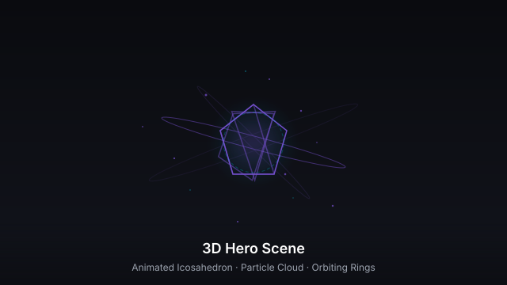
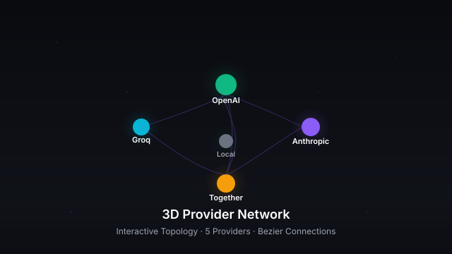
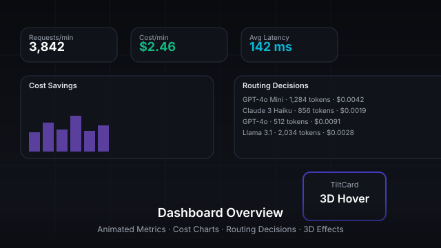

# LLM Cost Autopilot

[](https://llm-cost-autopilot.vercel.app)
[](https://react.dev/)
[](https://vite.dev/)
[](https://www.typescriptlang.org/)
[](https://threejs.org/)
[](https://tailwindcss.com/)
[](https://www.framer.com/motion/)
[](./LICENSE)
[](https://github.com/ZaheerAbbasOrakzai/llm-cost-autopilot/actions/workflows/ci.yml)

An interactive frontend prototype for exploring LLM cost routing, estimates, and dashboard concepts — rendered in real-time 3D.

> **Demo only:** this repository contains a React/Vite frontend. Its dashboard, provider status, request waterfall, costs, budgets, and alerts use hard-coded or simulated sample data. It does not connect to LLM providers, route real requests, monitor real infrastructure, persist settings, or enforce budgets. Do not use its estimates for billing or operational decisions.

Provider/model rates in the sample catalog are illustrative historical reference values, not a maintained price feed. Verify current provider pricing before using the cost calculator.

## Features

- 🎬 **Real-time 3D Hero Scene** — animated icosahedron with `MeshDistortMaterial`, orbiting rings, and 500 floating particles
- 🌐 **3D Provider Network Topology** — interactive WebGL graph with 5 providers, curved connections, and orbital controls
- 🖱️ **Cursor Particle System** — Canvas-based physics particles with gravity and additive blending
- 🃏 **Micro-interaction Effects** — TiltCard 3D perspective, HoloCard gradient borders, animated number counters
- 📊 **Interactive dashboards** with Recharts visualizations populated with sample values
- 🔀 **Simulated routing pipeline** with complexity classification and fallback chains
- 🎮 **API Playground** with real-time pipeline visualization (no network calls)
- ⌨️ **Command palette** (`⌘K`) and full keyboard navigation
- ⚡ **Lazy-loaded** 3D canvases and route chunks to reduce initial JavaScript

---

## 👁️ Visual Gallery

| 3D Hero Scene | 3D Provider Network |
|:---:|:---:|
|  |  |

| Dashboard Overview | 3D Effects & Micro-interactions |
|:---:|:---:|
|  |  |

> Each thumbnail above is an SVG rendering of the actual component visual design. Run `npm run dev` to experience the live real-time 3D animations and interactive effects in your browser.

## 📊 Pages

### 1. Dashboard
- 3D hero scene with animated particles
- Simulated metrics bar (requests/min, latency, cost, cache hit rate, error rate)
- 3D provider network topology
- Cost savings charts with sample data
- Complexity distribution analysis
- Model usage breakdown

### 2. Routing
- Simulated routing pipeline visualization
- Complexity classification with confidence scores
- Sample routing decisions table
- Fallback chain management
- Circuit breaker status

### 3. Providers
- Sample provider health and pricing data (OpenAI, Anthropic, Groq, Together, Local)
- Model comparison with quality scores
- Latency and uptime tracking

### 4. Teams & Budgets
- Real budget tracking with sparklines
- Spend attribution by team
- Budget alerts and thresholds
- Cost optimization metrics

### 5. Validation
- Quality validation radar charts
- Delta distribution analysis
- Pass/fail tracking
- LLM-as-judge evaluation scores

### 6. Cost Analysis
- Monthly cost breakdown by complexity tier
- Provider cost distribution
- Cost forecasting with confidence intervals
- ROI metrics and payback period
- Savings source analysis

### 7. API Playground
- Interactive routing test environment
- Real-time pipeline visualization
- Sample requests with actual use cases
- Detailed routing decision output

### 8. Settings
- Routing policy configuration
- System controls (autopilot, validation, circuit breakers)
- Budget enforcement settings
- Provider configuration

## 🏗️ Frontend Architecture

### Data Layer
```
src/
├── types/              # Real TypeScript interfaces
│   └── index.ts       # Frontend data types
├── api/               # Unused API client scaffold; no backend is included
├── data/              # Static sample data, not production telemetry
├── utils/             # Cost-estimation helpers using the sample price table
└── hooks/             # Simulated metrics and request feed
```

### Sample Price Assumptions
These values are examples from an old price snapshot and are not guaranteed current:
- **GPT-4o**: $5/1M input, $15/1M output
- **GPT-4o Mini**: $0.15/1M input, $0.60/1M output
- **Claude 3.5 Sonnet**: $3/1M input, $15/1M output
- **Claude 3 Haiku**: $0.25/1M input, $1.25/1M output
- **Llama 3.1 70B**: $0.59/1M input, $0.79/1M output
- **Mixtral 8x7B**: $0.24/1M input, $0.24/1M output

### Cost Calculation
```typescript
// Estimate using the bundled example price table
const cost = calculateCost('gpt-4o', 1000, 500);
// Returns: { inputCost: 0.005, outputCost: 0.0075, totalCost: 0.0125 }
```

## ⌨️ Keyboard Shortcuts

- `⌘K` / `Ctrl+K` - Command palette
- `⌘/` / `Ctrl+/` - Keyboard shortcuts overlay
- `⌘B` / `Ctrl+B` - Toggle sidebar
- `G + D` - Go to Dashboard
- `G + R` - Go to Routing
- `G + P` - Go to Providers
- `G + T` - Go to Teams
- `G + V` - Go to Validation
- `G + C` - Go to Cost Analysis
- `G + A` - Go to API Playground
- `G + S` - Go to Settings
- `Esc` - Close overlays

## 🎨 Design System

### Colors
- Primary: Violet (#8b5cf6)
- Secondary: Cyan (#06b6d4)
- Success: Emerald (#10b981)
- Warning: Amber (#f59e0b)
- Error: Red (#ef4444)

### Effects
- Glass morphism with backdrop blur
- Holographic borders on hover
- 3D tilt cards with perspective
- Animated gradient text
- Particle systems with physics
- Smooth page transitions
- Noise texture overlays

> See the [🎬 3D Animations & Visual Effects](#-3d-animations--visual-effects) section below for a detailed breakdown of every visual component.

---

## 🎬 3D Animations & Visual Effects

The application layers multiple complementary visual systems — Three.js real-time 3D scenes, Canvas-based particle physics, CSS-driven micro-interactions, and Framer Motion page transitions — to create a cohesive "cyber-physical" dashboard experience.

| Visual Layer | Library | Purpose |
|---|---|---|
| **Real-time 3D Scene** | Three.js + React Three Fiber | Hero sphere, provider topology, data particles |
| **Canvas Particles** | Native Canvas 2D API | Cursor trails, interactive feedback |
| **CSS / Tailwind** | Tailwind CSS 4 | Glass-morphism, holographic borders, gradients |
| **UI Animation** | Framer Motion | Page transitions, modal overlays, hover states |
| **Number Tweening** | `requestAnimationFrame` + cubic ease-out | Animated metric counters |

### 1. 3D Hero Scene (`HeroScene3D.tsx`)

The dashboard centerpiece is a fully interactive WebGL canvas powered by React Three Fiber.

| Component | Description |
|---|---|
| **Animated Icosahedron** | A subdivided icosahedron (4th-level detail → 1282 vertices) with `MeshDistortMaterial` producing a liquid-metal surface distortion. Rotates continuously on X/Y axes; floats with `Float` for subtle bobbing. |
| **Orbiting Rings** | Three concentric torus geometries (3 / 3.5 / 4 unit radii) rotated at different axes (`π/2`, `π/4`, `π/3`) and animated independently for a layered orbital effect. Each ring uses a transparent `meshBasicMaterial` with decreasing opacity. |
| **Data Particles** | 500 point-cloud particles distributed on a spherical shell using spherical-coordinate math (`θ`, `φ`, `r`). Each particle is color-coded from the design palette (violet `#8b5cf6`, cyan `#06b6d4`, emerald `#10b981`, amber `#f59e0b`) and rotates slowly on Y/X axes. |
| **Lighting Rig** | Three-point setup: ambient light (0.3), violet point light at `[10,10,10]`, cyan point light at `[-10,-10,-10]`, and a green-tinted spot light with angle 0.3 rad and full penumbra. |
| **Overlay** | CSS gradient overlay (transparent → `#0a0b0f`) for depth layering against page content. |

**Performance**: Lazy-loaded via `React.lazy()` + `Suspense` with a skeleton fallback.

### 2. 3D Provider Network (`ProviderNetwork3D.tsx`)

An interactive topology map of five simulated LLM providers rendered in real-time 3D.

| Component | Description |
|---|---|
| **Provider Spheres** | Five spheres (OpenAI, Anthropic, Groq, Together, Local) positioned in 3D space. Size scales with `sqrt(requests/10000) * 0.3 + 0.3`. Each uses `meshStandardMaterial` with emissive glow. |
| **Glow Effect** | Secondary transparent sphere (1.5× node size) at 10% opacity, pulsing via `sin()` scaling. |
| **Status Indicators** | Small cap spheres: green (healthy), amber (degraded), red (down). |
| **3D Labels** | `Text` component from `@react-three/drei` renders names in world-space, above each node. |
| **Connection Lines** | `QuadraticBezierCurve3` creates smooth arcs between all provider pairs at 30% opacity. |
| **Particle Field** | 200 background particles in a `[-10, 10]` cube, slowly rotating for depth. |
| **Orbit Controls** | Auto-rotate enabled; zoom/pan disabled; polar angle clamped `π/3`–`π/1.5`. |

### 3. Cursor Particle System (`CursorParticles.tsx`)

A full-viewport `<canvas>` overlay emitting physics-driven particles on mouse movement.

| Property | Value |
|---|---|
| **Emit rate** | 2 particles per mouse-move event |
| **Max particles** | 100 (oldest spliced when exceeded) |
| **Life span** | 30–50 frames (random per particle) |
| **Physics** | Gravity (`vy += 0.05`/frame); random initial velocity |
| **Rendering** | `ctx.globalAlpha` fade; `mix-blend-mode: screen` for additive lighting |
| **Z-index** | Fixed `inset-0`, `z-50`, `pointer-events-none` |

### 4. Micro-interaction Effects (`Effects.tsx`)

#### TiltCard — 3D Perspective Hover

```typescript
// Source: src/components/ui/Effects.tsx
export function TiltCard({ children, className, intensity = 15 }) {
  // onMouseMove → calculate rotation from cursor position relative to card center
  // rotateX = (y - centerY) / centerY * -intensity  (±15° default)
  // rotateY = (x - centerX) / centerX * +intensity
  // scale3d(1.02) on hover for subtle pop
}
```

| Sub-effect | Details |
|---|---|
| **3D Transform** | `perspective(1000px)` + `rotateX`/`rotateY` computed from mouse position relative to card bounds |
| **Glare Overlay** | `radial-gradient(circle at X%, Y%, rgba(255,255,255,0.15), transparent 50%)` follows cursor with 0.2s opacity transition |
| **Scale** | `scale3d(1.02, 1.02, 1.02)` applied on hover for tactile depth |
| **Reset** | `transformStyle: preserve-3d` restored to neutral on mouse-leave over 0.1s |

#### HoloCard — Holographic Border

```typescript
// Source: src/components/ui/Effects.tsx
export function HoloCard({ children, className }) {
  // Dual-layer gradient border that fades in on group-hover
}
```

| Effect | Details |
|---|---|
| **Border Layer 1** | `absolute -inset-[1px]`, `bg-gradient-to-r from-violet-500 via-cyan-400 to-emerald-400`, `opacity-0 → opacity-100` on hover, `blur-sm` for scan-line glow |
| **Border Layer 2** | Same gradient at `opacity-0 → opacity-70` for solid outline |
| **Background** | `#12141c` rounded-2xl container for contrast |
| **Duration** | 500ms transition on hover |

#### AnimatedNumber — Smooth Counter Tween

```typescript
// Source: src/components/ui/Effects.tsx
export function AnimatedNumber({ value, prefix, suffix }) {
  // requestAnimationFrame loop with cubic ease-out (1 - (1 - p)³)
  // Duration: 1500ms
}
```

| Property | Value |
|---|---|
| **Animation** | `requestAnimationFrame` with cubic ease-out (`1 - Math.pow(1 - progress, 3)`) |
| **Duration** | 1500ms |
| **Formatting** | `toLocaleString()` for ≥100; `toFixed(1)` for <100 |
| **Prefix/Suffix** | Configurable (e.g., `$`, `%`, `K`) |

#### Cursor Particle System Recap

Rendered globally via `<CursorParticles />` in `App.tsx`:

| Parameter | Value | Implementation |
|---|---|---|
| Emit rate | 2 per `mousemove` | `addEventListener('mousemove', …)` |
| Max count | 100 | FIFO splice when exceeded |
| Physics | Gravity `vy += 0.05`/frame | Per-frame `requestAnimationFrame` loop |
| Canvas | Full viewport, `z-50`, `pointer-events-none` | `mix-blend-mode: screen` |
| Colors | `#8b5cf6`, `#06b6d4`, `#10b981`, `#f59e0b` | Random selection per particle |
| Alpha | `1 - life/maxLife` | Per-frame fade-out |

### 5. Page Transitions

| Transition | Effect |
|---|---|
| **Route change** | `AnimatePresence` + keyed `motion.div`: fade + slide over 300ms |
| **Dashboard load** | Staggered children (0.06s stagger); fade + slide-up for metric cards |
| **Hero text** | Delayed fade-in (500ms / 800ms) |

### 6. Visual Asset Gallery

| Asset | Type | Location |
|---|---|---|
| Icosahedron with distortion | Three.js mesh + MeshDistortMaterial | `HeroScene3D.tsx` |
| Orbiting torus rings | Three.js torus geometry | `HeroScene3D.tsx` |
| Spherical particle cloud | Three.js Points + BufferGeometry | `HeroScene3D.tsx` |
| Provider network topology | Three.js + Drei (Sphere, Text, Line) | `ProviderNetwork3D.tsx` |
| Bezier connection arcs | Three.js QuadraticBezierCurve3 | `ProviderNetwork3D.tsx` |
| Cursor particle trail | Canvas 2D API | `CursorParticles.tsx` |
| Tilt + glare effect | CSS transforms + radial-gradient | `Effects.tsx` → `TiltCard` |
| Holographic border | Tailwind animated gradient | `Effects.tsx` → `HoloCard` |
| Gradient text | CSS `bg-clip-text` | Dashboard hero heading |
| Glass-morphism cards | `backdrop-blur` + `bg-white/[0.02]` | All metric cards |

### 7. Rendering Architecture

```
Browser Window
├── <CursorParticles />     ← full-viewport canvas (blend-mode: screen)
├── <App />
│   ├── <Suspense>          ← lazy route chunks
│   │   ├── <Dashboard>
│   │   │   ├── <HeroScene3D>      ← <Canvas> with R3F
│   │   │   ├── <TiltCard>         ← CSS 3D transform + glare
│   │   │   ├── <HoloCard>         ← gradient border on hover
│   │   │   ├── <ProviderNetwork3D>← <Canvas> with R3F
│   │   │   ├── <AnimatedNumber>   ← rAF tween
│   │   │   └── ...
│   │   └── ...
│   ├── <CommandPalette>
│   └── <KeyboardShortcutsOverlay>
└── <ToastProvider>
```

## 📦 Tech Stack

- **React 18** with TypeScript
- **Vite** for blazing fast builds
- **Tailwind CSS 4** for styling
- **Framer Motion** for animations
- **Three.js** + React Three Fiber for 3D
- **Recharts** for data visualization
- **React Query** for data fetching
- **Zustand** for state management
- **Lucide React** for icons

## 🚀 Getting Started

```bash
# Install dependencies
npm install

# Start development server
npm run dev

# Build for production
npm run build

# Preview production build
npm run preview
```

## 🔧 Environment Variables

```env
VITE_API_URL=http://localhost:8000  # Backend API URL
```

## 📈 Demo Metrics

The dashboard animates simulated values for requests/minute, latency, cost/minute, active models, cache hit rate, and error rate. These numbers do not come from a running service.

## 🎯 Key Features

### Intelligent Routing
- Complexity classification (simple/medium/hard)
- Cost-aware model selection
- Quality threshold enforcement
- Automatic fallback chains
- Circuit breaker protection

### Cost Optimization
- Illustrative cost comparisons
- Sample budget and savings views
- Input-validated cost and ROI helper functions

### Quality Assurance
- Continuous validation sampling
- LLM-as-judge evaluation
- Quality delta monitoring
- Automatic policy adjustment
- Accuracy tracking

### Monitoring & Alerts
- Real-time system health
- Provider status monitoring
- Budget threshold alerts
- Performance degradation detection
- Circuit breaker notifications

## Backend integration status

No backend, authentication flow, database, live pricing feed, WebSocket service, or provider integration is included. `VITE_API_URL` is only a placeholder for a future backend; setting it does not make this frontend connect to one. A production deployment requires a secure server-side provider integration, credentials kept off the client, real telemetry/storage, and verified pricing.

## 📝 License

MIT License

## 🤝 Contributing

Contributions that clearly distinguish working behavior from demo data are welcome.

---

**Built as an LLM cost-optimization UI prototype**
